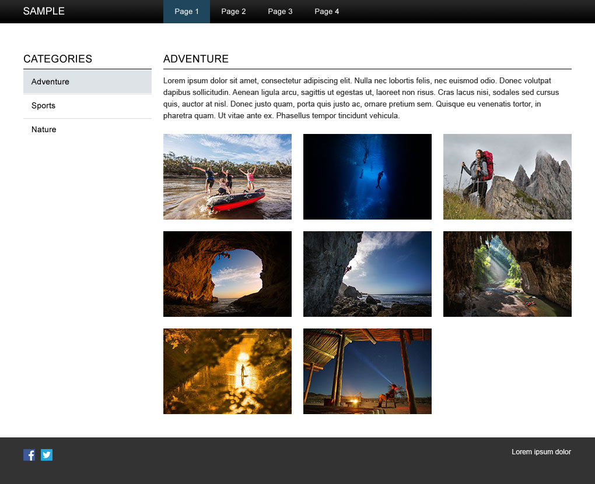

## Instructions

Relax and get ready to have some fun with this little exercise! Your mission is to layout the page represented in the comp located at **assets/sample-build.sketch**. Use the comp to determine layout specifications like sizes, colors, spacing, fonts, etc…. Match the comp as closely as possible.

- You will be evaluated on the cleanliness and organization of your code. Consider using a naming convention like BEM for your classes.  https://css-tricks.com/bem-101/
- The header links do not need to link anywhere but their hover state should work (hover state same as active)
- The left menu links do not need to link anywhere but their hover state should work (hover state same as active)
- Feel free to set up your sample build’s directory structure however you chose
- The page should be responsive. While there is not a mobile design provided, you should construct your css in such a way that the page works within a mobile screen (stacking elements on top of each other as necessary)
- Submit your completed solution as a pull request to this repo
- Also submit a link to your page, as deployed to github pages to https://goo.gl/forms/kwEA8fUc2kBJuVQu1
- Below is a step that will earn you bonus points

Bonus

- Use the JSON data located in assets/data-bonus.json to render the content shown in the main section.

